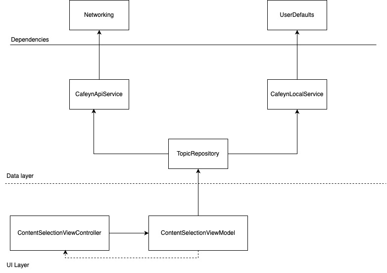

#Cafeyn Interest Selection

This application fetches and displays Cafeyn topics.
It is built using Xcode 15.3 and follows the MVVM (Model-View-ViewModel) design pattern for a clean and maintainable codebase.
A separate Swift Package Manager (SPM) package handles networking, ensuring modularity and reusability.
The code is highly testable, with unit tests covering all use cases.

#How to run

Opening Xcode and running the project will be enough, no further action is needed to run the app.

#Architecture
  
